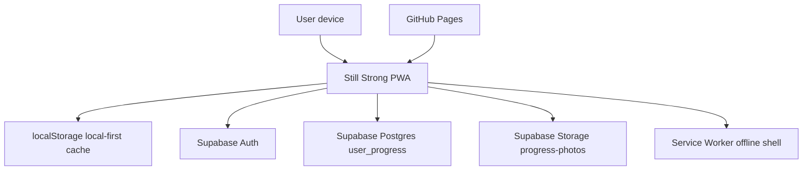

# Still Strong Architecture

## System Architecture



## Data Flow

1. The app loads as a static PWA from GitHub Pages.
2. App state initializes from `localStorage`.
3. If Supabase is configured and a user is signed in, the app loads `user_progress.progress`.
4. Local changes persist immediately to `localStorage`.
5. Signed-in changes upsert to `user_progress`.
6. Progress photos upload to `progress-photos/{user_id}/{photo_id}.jpg`.
7. Photo metadata is stored in the progress JSON record.
8. Private photos render through signed URLs.

## Database Schema

### `public.user_progress`

| Column | Type | Purpose |
| --- | --- | --- |
| `user_id` | `uuid` | Auth user ID, primary key |
| `progress` | `jsonb` | MVP progress document |
| `updated_at` | `timestamptz` | Last write time |

## Storage Layout

```text
progress-photos/
  {user_id}/
    {photo_id}.jpg
```

Users can only access files where the first folder segment matches their auth UID.

## UI Architecture

- Today quick-start flow
- Plan adjustment controls
- Workout plan and session mode
- Exercise library
- Meals and recipe ideas
- Photo progress
- Weekly rhythm
- Account and sync

## API Surface

This MVP is client-only. The external API surface is Supabase:

- `auth.signUp`
- `auth.signInWithPassword`
- `auth.signOut`
- `from("user_progress").select/upsert`
- `storage.from("progress-photos").upload/remove/createSignedUrl`

## Current Scalability Limit

The MVP stores most progress as a single JSON document. That is fast to build and acceptable for early testing. At scale, split it into normalized tables:

- `profiles`
- `workout_sessions`
- `exercise_sets`
- `pain_logs`
- `meal_logs`
- `progress_photos`
- `custom_exercises`

## Recommended Future Folder Structure

```text
src/
  app/
    bootstrap.js
    state.js
    router.js
  features/
    account/
    exercises/
    meals/
    photos/
    progress/
    workouts/
  services/
    supabaseClient.js
    progressRepository.js
    photoStorage.js
  ui/
    components/
    renderers/
  data/
    exerciseLibrary.js
    recipes.js
```
